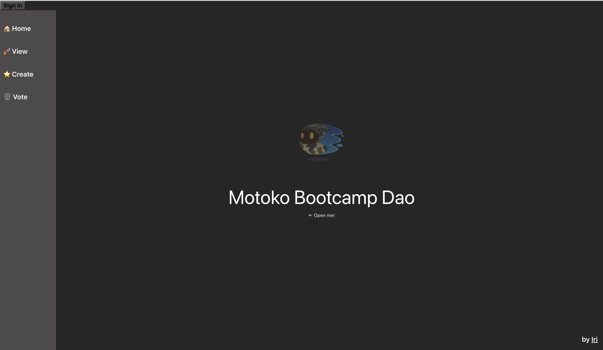

# 👻 Motoko Bootcamp 2023 

A huge thanks to [Iri](https://twitter.com/iriasviel) (ex-Motoko Bootcamp student | Motoko dev at Finterest) for contributing to the core project. 
You can use this repository as a starting point for your the [core project](https://github.com/motoko-bootcamp/motokobootcamp-2023) of [Motoko Bootcamp 2023](https://github.com/motoko-bootcamp/motokobootcamp-2023).

<p align="center">  </p>
<p align="center">To see the navigation bar hover on the left.</p>

A few more things:
- To build the core project you should complete the code that is missing for the dao canister and webpage canister.
- Using this skeleton is NOT a requirement. This repository is only meant to help you get started. 
- The core project has to be submitted before the deadline - more infos on #submit.
- [Plug wallet is used] and we recommend using it for this core project to make your life easier: mainly because **Principal** for users will be the same between canisters (not the case with Internet Identity which makes the whole project more complex).

- There are probably some little bugs and errors - the code has been quickly hacked to help you get on track and focus on Motoko but this is far from being a perfect example.

## Instructions to deploy 
Install the necessary packages.
```
npm install
```
Start your replica
```
dfx start
```
Deploy locally 
```
dfx deploy
```

dfx deploy --argument "(record {
 accounts = vec { record { owner = principal \"$ALICE\"; tokens = record { amount_e8s = 100_000_000 }; };
                  record { owner = principal \"$BOB\"; tokens = record { amount_e8s = 100_000_000 };}; };
 proposals = vec {};
 system_params = record {
     transfer_fee = record { amount_e8s = 10_000 };
     proposal_vote_threshold = record { amount_e8s = 10_000_000 };
     proposal_submission_deposit = record { amount_e8s = 10_000 };
 };
})"

dfx deploy --argument "(record {
 accounts = vec {};
 proposals = vec {};
 system_params = record {
     transfer_fee = record { amount_e8s = 10_000 };
     proposal_vote_threshold = record { amount_e8s = 10_000_000 };
     proposal_submission_deposit = record { amount_e8s = 10_000 };
 };
})"

dfx deploy --network ic --argument "(record {
 accounts = vec {};
 proposals = vec {};
 system_params = record {
     transfer_fee = record { amount_e8s = 10_000 };
     proposal_vote_threshold = record { amount_e8s = 10_000_000 };
     proposal_submission_deposit = record { amount_e8s = 10_000 };
 };
})"

dfx deploy --network ic --wallet "$(dfx identity --network ic get-wallet)" --argument "(record {
 accounts = vec {};
 proposals = vec {};
 system_params = record {
     transfer_fee = record { amount_e8s = 10_000 };
     proposal_vote_threshold = record { amount_e8s = 10_000_000 };
     proposal_submission_deposit = record { amount_e8s = 10_000 };
 };
})"

dfx canister call dao get_dev_errors

dfx canister call dao get_update_params_debug

dfx canister call dao test_extracting_from_string "{ updatedSpaceData: \"htmlgggg\", }"

dfx canister call dao test_extracting_from_string "{ id: 5, updatedOwnerName: 'new owner', updatedOwnerContactInfo: 'new contact', updatedSpaceDescription: 'new desc', updatedSpaceName: \"newName\", updatedSpaceData: \"htmlgg,gg\", }"

dfx canister call dao test_extracting_from_string "{\"id\":5,\"updatedOwnerName\":\"new, owner\",\"updatedOwnerContactInfo\":\"new, contact\",\"updatedSpaceDescription\":\"new d,esc\",\"updatedSpaceName\":\"newN,ame\",\"updatedSpaceData\":\"htmlg,,ggg\"}"

dfx canister --network ic call dao test_extracting_from_string "{\"id\":1,\"updatedOwnerName\":\"Seagull DAO\",\"updatedOwnerContactInfo\":\"Laugh like a Seagull and we'll find you\",\"updatedSpaceDescription\":\"Seagull DAO HQ - where the Seagulls laugh and dance all day\",\"updatedSpaceName\":\"Porto\",\"updatedSpaceData\":\"<html>   <head>     <script src=\"https://aframe.io/releases/1.3.0/aframe.min.js\"></script>   </head>   <body>     <a-scene cursor=\"rayOrigin: mouse\">       <a-assets>                <a-mixin id=\"floorMat\" material=\"color:#BBB\"></a-mixin>                                       </a-assets>            <a-plane src=\"#groundTexture\" rotation=\"-90 0 0\" position=\"0 -0.01 0\" height=\"100\" width=\"100\"></a-plane>            <a-light type=\"directional\" intensity=\"0.9\" position=\"-1 -2  2\"></a-light>       <a-light type=\"directional\" intensity=\"1.0\" position=\" 2  1 -1\"></a-light>        <a-box id=\"box1\" position=\"-1 0.5 -3\" rotation=\"0 45 0\" color=\"#4CC3D9\"></a-box>       <a-sphere position=\"0 1.25 -5\" radius=\"2.25\" color=\"#EF2D5E\"></a-sphere>       <a-cylinder position=\"1 0.75 -3\" radius=\"0.5\" height=\"1.5\" color=\"#FFC65D\"></a-cylinder>       <a-plane position=\"0 0 -4\" rotation=\"-90 0 0\" width=\"4\" height=\"4\" color=\"#7BC8A4\"></a-plane>       <a-sky color=\"#ECECEC\"></a-sky>        <a-entity id=\"edit-button\" geometry=\"primitive: box; width: 0.5; height: 0.2; depth: 0.001\" material=\"opacity: 0.1; color: red;\" position=\"-2.5 3 -3\" text=\"align: center; color: black; value: Edit Space; width: 2\"></a-entity>       <a-entity id=\"login-button\" geometry=\"primitive: box; width: 0.5; height: 0.2; depth: 0.001\" material=\"opacity: 0.1; color: blue;\" position=\"2.5 3 -3\" text=\"align: center; color: black; value: Log in; width: 3\"></a-entity>     </a-scene>   </body> </html>\"}"

## Live demo

There are 2 versions of this app deployed on the IC. 

- This example (without the backend completed so any request will fail): https://raisq-jyaaa-aaaaj-qazrq-cai.ic0.app/
- Completed version (with the backend completed - source code not available): https://xmfll-uyaaa-aaaah-ab2ja-cai.ic0.app/ 

## Common (strange) error
- When using Plug wallet you might encounter the following: "Uncaught (in promise) Error: There isn't enough space to open the popup" - if that's the case make sure to reduce your browser windows and give some space for the popup windows to appear.
